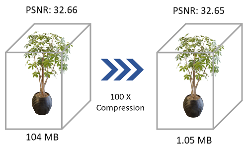
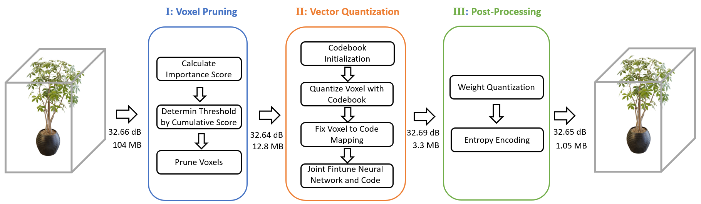

# Compressing Volumetric Radiance Fields to 1 MB (CVPR2023)

Lingzhi Li*, Zhen Shen*, Zhongshu Wang, Li Shen, Liefeng Bo

Alibaba Group






**Note**: This repository only contain VQ-DVGO. We will add VQ-Plenoxels and VQ-TensoRF in the future.


## Setup

- Download datasets:
        [NeRF](https://drive.google.com/drive/folders/128yBriW1IG_3NJ5Rp7APSTZsJqdJdfc1)
        [NSVF](https://dl.fbaipublicfiles.com/nsvf/dataset/Synthetic_NSVF.zip),  [T&T (masked)](https://dl.fbaipublicfiles.com/nsvf/dataset/TanksAndTemple.zip)


- Install required libraries
```
pip install -r requirements.txt
cd lib/cuda
python setup.py install
```

Please  install the correct version of [Pytorch](https://pytorch.org/) and [torch_scatter](https://github.com/rusty1s/pytorch_scatter) for your machine.

## Directory structure for the datasets

<!-- <details>
  <summary> (click to expand;) </summary> -->
```
data
├── nerf_synthetic     # Link: https://drive.google.com/drive/folders/128yBriW1IG_3NJ5Rp7APSTZsJqdJdfc1
│   └── [chair|drums|ficus|hotdog|lego|materials|mic|ship]
│       ├── [train|val|test]
│       │   └── r_*.png
│       └── transforms_[train|val|test].json
│
├── Synthetic_NSVF     # Link: https://dl.fbaipublicfiles.com/nsvf/dataset/Synthetic_NSVF.zip
│   └── [Bike|Lifestyle|Palace|Robot|Spaceship|Steamtrain|Toad|Wineholder]
│       ├── intrinsics.txt
│       ├── rgb
│       │   └── [0_train|1_val|2_test]_*.png
│       └── pose
│           └── [0_train|1_val|2_test]_*.txt
│
│
└── TanksAndTemple     # Link: https://dl.fbaipublicfiles.com/nsvf/dataset/TanksAndTemple.zip
    └── [Barn|Caterpillar|Family|Ignatius|Truck]
        ├── intrinsics.txt
        ├── rgb
        │   └── [0|1|2]_*.png
        └── pose
            └── [0|1|2]_*.txt
    
```


<!-- </details> -->

## Training

```
# for nerf_synthetic datasets
python autotask_final.py -g "0 1 2 3 4 5 6 7"  --configname syn_4096code 

# for Synthetic_NSVF datasets
python autotask_final.py -g "0 1 2 3 4 5 6 7"  --configname nsvf_4096code --dataset nsvf

# for TanksAndTemple datasets
python autotask_final.py -g "0 1 2 3 4 5 6 7"  --configname tnt_4096code  --dataset tnt
```

Fixing TanksandTemples dataset following this [issue](https://github.com/sunset1995/DirectVoxGO/issues/4)

Set `-g` option according to the availible gpu on your machine. 

## Testing 

```
# for nerf_synthetic datasets
python autotask_eval_only.py -g "0 1 2 3 4 5 6 7"  --configname syn_4096code 

# for Synthetic_NSVF datasets
python autotask_eval_only.py -g "0 1 2 3 4 5 6 7"  --configname nsvf_4096code --dataset nsvf

# for TanksAndTemple datasets
python autotask_eval_only.py -g "0 1 2 3 4 5 6 7"  --configname tnt_4096code  --dataset tnt
```
